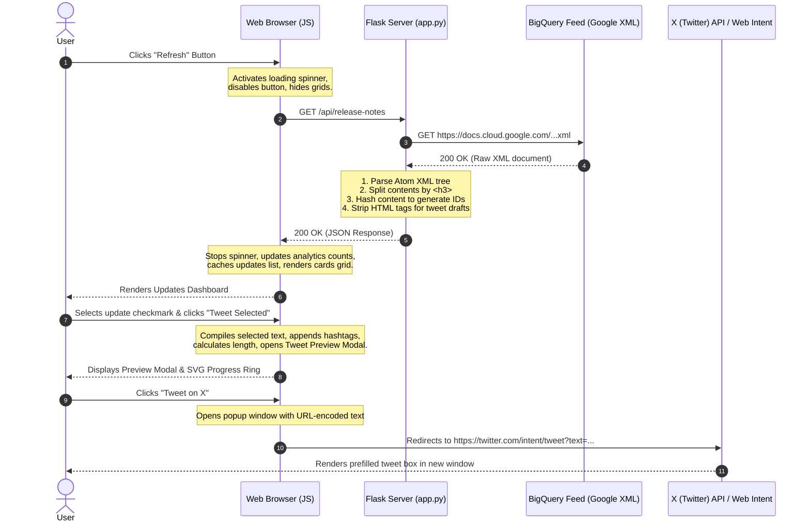

# Detailed Architecture & Data Flow Guide

This document breaks down the BigQuery Release Notes Web Application codebase, explaining its features, Server-Side logic, Client-Side state management, and the step-by-step sequence of a request-response flow.

---

## 🌟 Core Features Recap

1. **Granular Feed Parsing**: Translates raw, daily-grouped Atom XML feed entries into separate, distinct update objects (Feature, Issue, Changed, Deprecated, Fixed) using `<h3>` tags.
2. **Dashboard Metrics**: Computes statistics on categories in real-time.
3. **Interactive Search & Filter Engine**: Filters updates dynamically using text search (matching titles, types, and descriptions) and category filters.
4. **Interactive Multi-Selection Deck**: A persistent sliding toolbar that manages a set of selected updates to generate a batch tweet.
5. **Twitter Composer Modal with Progress Ring**: Provides a mock Twitter/X tweet draft box with character counting, custom progress rings (via SVG stroke manipulation), clipboard copying, and direct Web Intent triggers.

---

## 🖥️ Server-Side Architecture (Python & Flask)

The backend code is housed in [app.py](file:///Users/rubinadas/bigquery_release_notes/app.py). Its responsibility is serving files and acting as an API gateway that fetches, parses, and formats the external XML feed.

```
       +---------------------------------------------+
       |                  app.py                     |
       +---------------------------------------------+
         /                                         \
  [Route: /]                                [Route: /api/release-notes]
       |                                             |
Serves index.html                            Fetches BQ XML feed
                                             Parses Atom XML
                                             Splits by <h3> tags
                                             Strips HTML tags for plain text
                                             Generates MD5 content hashes
                                             Returns application/json
```

### 1. External Data Fetching
To read the feed, the server initiates an HTTPS request to `https://docs.cloud.google.com/feeds/bigquery-release-notes.xml`.
* **SSL Bypassing**: In macOS environments, local Python installations often lack root CA certificates. The server bypasses this safely using:
  ```python
  context = ssl._create_unverified_context()
  ```
* **User-Agent header**: The server sends a custom User-Agent to avoid scraping blocks:
  ```python
  headers={'User-Agent': 'Mozilla/5.0...'}
  ```

### 2. XML Parsing Algorithm
The feed uses the **Atom XML Schema** (`http://www.w3.org/2005/Atom`). The parser:
* Defines the namespace mapping: `namespaces = {'atom': 'http://www.w3.org/2005/Atom'}`.
* Searches for all `atom:entry` elements using `xml.etree.ElementTree`.
* Extracts the entry title (e.g., `June 15, 2026`), representing the update date.

### 3. Granular HTML Splitting (The `<h3>` Split)
For each entry, the description content (`atom:content`) contains raw HTML. The script parses individual updates by splitting on `<h3>` tags:
1. `content_html.split('<h3>')` divides the text into chunks.
2. For each chunk containing `</h3>`, the text before it is marked as the `type` (e.g., `Feature`, `Issue`), and the text after it is the description `html`.
3. An MD5 checksum of the date concatenated with the first 100 characters of the update creates a stable, unique ID for state matching in the frontend:
   ```python
   content_hash = hashlib.md5((date_str + update_html[:100]).encode('utf-8')).hexdigest()
   update_id = f"up-{content_hash[:12]}"
   ```
4. A regex strips HTML tags to compile a clean, plain text version of the description used for tweets:
   ```python
   plain_text = re.sub(r'<[^<]+?>', '', html_content)
   ```

---

## ⚡ Client-Side Architecture (HTML, CSS, JS)

The frontend uses vanilla technologies to achieve high responsiveness and a sleek appearance.

### 1. UI Structure & Styling
* **HTML Skeleton ([templates/index.html](file:///Users/rubinadas/bigquery_release_notes/templates/index.html))**: Employs semantic elements (`<header>`, `<main>`, `<section>`, `<article>`, `<footer>`) with descriptive, unique element IDs.
* **Styling System ([static/css/style.css](file:///Users/rubinadas/bigquery_release_notes/static/css/style.css))**: 
  * Implements a dark mode color palette utilizing deep obsidian `#07090e` and secondary layers `#0d121f`.
  * Glowing glassmorphism styling is applied using `backdrop-filter: blur(12px)`.
  * Visual highlights include dynamic badges and custom checkboxes utilizing pseudo-elements (`:after` / `:checked`).

### 2. Frontend State Machine ([static/js/app.js](file:///Users/rubinadas/bigquery_release_notes/static/js/app.js))
The client keeps track of active user selections and display states using four key variables:
```javascript
let releaseUpdates = [];        // Raw list of parsed update objects from server
let selectedUpdateIds = new Set(); // Set of currently selected update IDs
let currentFilterType = 'all';  // Selected category pill ('all', 'Feature', etc.)
let currentSearchQuery = '';    // Cleaned lowercase search text
```

* **Data Filtering**: When the user searches or clicks filter pills, JS recalculates the list matching these filters and updates the DOM:
  ```javascript
  const filtered = releaseUpdates.filter(up => {
      const matchesType = currentFilterType === 'all' || up.type === currentFilterType;
      const matchesSearch = !currentSearchQuery || up.text.toLowerCase().includes(currentSearchQuery);
      return matchesType && matchesSearch;
  });
  ```
* **Checkbox State Sync**: Toggling card checkmarks updates the `selectedUpdateIds` Set and toggles a `.selected` highlight class on the card. If the size of the set is $>0$, the selection bar is shown; otherwise, it is hidden.

### 3. SVG Character limit Indicator
The circular counter in the tweet modal uses standard vector math:
* Radial circle radius is `14px`, meaning the circumference is $2 \cdot \pi \cdot 14 \approx 87.96\text{px}$.
* The circle has `stroke-dasharray="87.96"` and `stroke-dashoffset="87.96"`.
* When writing text, the percentage of limits is mapped to the stroke offset:
  ```javascript
  const percent = Math.min(100, (length / 280) * 100);
  const offset = circumference - (percent / 100) * circumference;
  charProgressCircle.style.strokeDashoffset = offset;
  ```
* The circle stroke shifts from cyan (safe) to orange (approaching limit) to red (exceeded).

---

## 🔄 Sequence Trace: Complete Data Flow

The diagram below maps the interaction cycle when a user clicks the **Refresh** button to retrieve release notes, select one, and post a tweet.



---

## 🛠️ Step-by-Step Sample Trace

Let's trace a concrete example of an update parsing from XML to a finished Tweet:

### 1. The XML Raw Content
The server fetches the feed and locates this entry:
```xml
<entry>
  <title>June 15, 2026</title>
  <content type="html">
    <h3>Feature</h3>
    <p>Use Gemini Cloud Assist to analyze your SQL queries...</p>
  </content>
</entry>
```

### 2. Server Parsing and Hashing
The Python engine splits on `<h3>` and extracts:
* **Date**: `"June 15, 2026"`
* **Type**: `"Feature"`
* **HTML**: `"<p>Use Gemini Cloud Assist to analyze your SQL queries...</p>"`
* **Plain Text**: `"Use Gemini Cloud Assist to analyze your SQL queries..."`
* **MD5 Hashing**: Concatenates `"June 15, 2026"` and `"<p>Use Gemini Cloud Assist..."`, resulting in ID `"up-bd10a9a6021d"`.

It returns this in a JSON array:
```json
{
  "id": "up-bd10a9a6021d",
  "date": "June 15, 2026",
  "type": "Feature",
  "html": "<p>Use Gemini Cloud Assist...</p>",
  "text": "Use Gemini Cloud Assist..."
}
```

### 3. JavaScript Interception and Rendering
The browser receives the JSON:
* Instantiates a DOM element: `<article class="note-card" id="card-up-bd10a9a6021d">`
* Fills the HTML content and registers checkbox events pointing to the ID.
* Binds the tweet button to trigger `openTweetModal()`.

### 4. Tweet Generation
When the user clicks the tweet icon for this update, JS compiles:
```
📢 BigQuery Feature (June 15, 2026):

Use Gemini Cloud Assist to analyze your SQL queries and receive recommendations to optimize query performance in BigQuery. This feature is available to customers who use BigQuery editions. This feature is in Preview.

#GoogleCloud #BigQuery
```
* The character length is **264 characters**.
* Remaining characters: **16**.
* The progress ring percentage: **94.2%** ($264/280 \cdot 100$).
* Dash offset: $87.96 \cdot (1 - 0.942) \approx 5.1\text{px}$.
* The circle color switches to orange warning since remaining characters $\le 40$.
* Clicking "Tweet on X" launches `https://twitter.com/intent/tweet?text=📢%20BigQuery%20Feature...` in a new tab.
